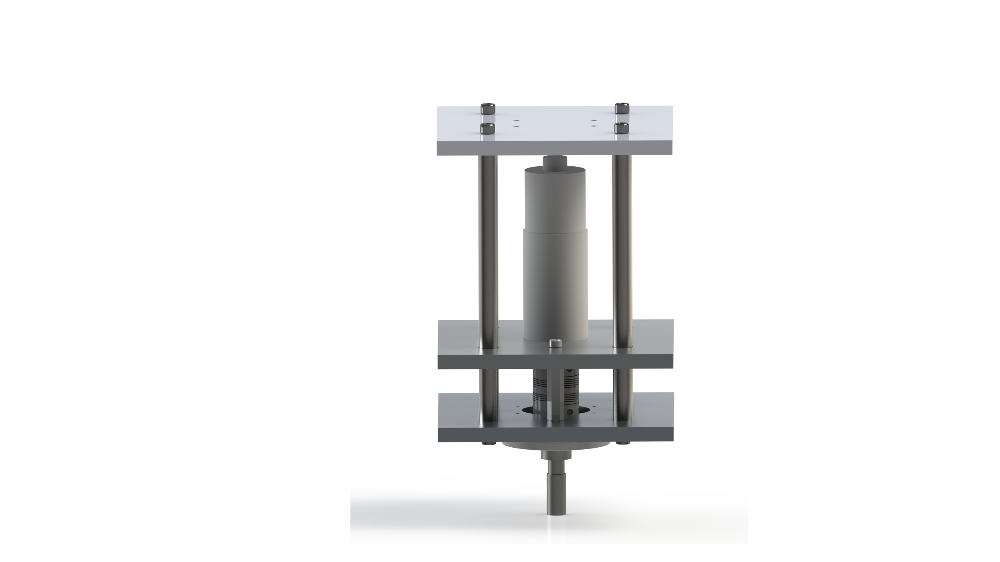
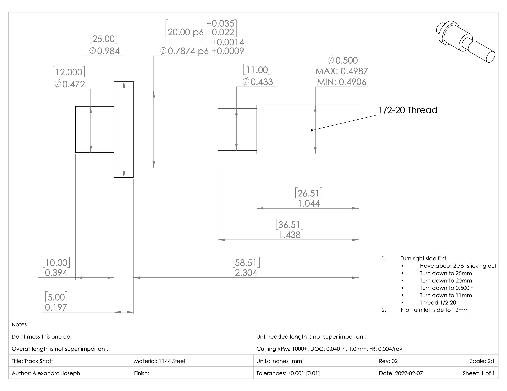

<!-- # Core Scanning Device -->

|  |

Research Assistant \
Colorado School of Mines

#### Dates

August 2021 to Present

#### Description

In this project I am tasked with the design, fabrication, and hardware-software interface of a device to automate the 2D to 3D reconstruction of drill core boxes. The 2D to 3D reconstruction process consists of taking a number of pictures of the object from different angles, and then a software solution is used to create a high-quality 3D model of the object that can be viewed via computer or VR headset. Since taking photographs by hand is both time consuming and challenging due to considerations such as lighting, maintaining correct focus, etc, it was desired to automate the process.

I am fully in charge of the project.

#### Work Summary

* Reviewed optics fundamentals for camera sensor and lens selection
* Reviewed optics fundamentals for device design parameters, such as required camera distance from the box
* Used engineering fundamentals for preliminary design analysis
* Used computer-aided design software for advanced design and design analysis
* Fabricated parts using manual mill and manual lathe
* Used engineering fundamentals for selecting appropriate device components, such as linear slides and motors
* Integrating linear slide, motor, and camera software to move the camera and take the picture
* Integrating the above process with open-source 2D to 3D reconstruction software
* Managing $15,000 budget

#### Skills Applied

* Research
* Engineering analysis
* Computer-aided design (SolidWorks)
* Computer-aided engineering
* Manual mill
* Manual lathe
* Part selection
* Device assembly
* Python programming
* Linux/Unix command line
* Git

### Images

|  |
| :-- |
| *The motor mount assembly.* |

|  |
| :-- |
| *SolidWorks render of the motor mount assembly.* |

|  |
| :-- |
| *Example technical drawing for a designed part.* |
