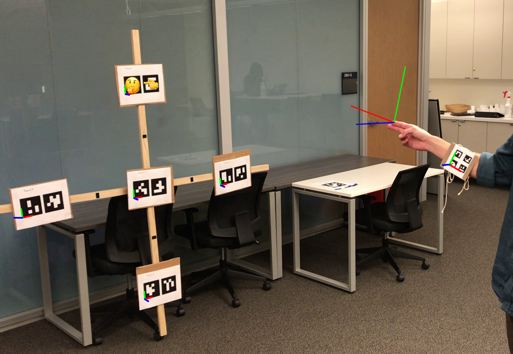
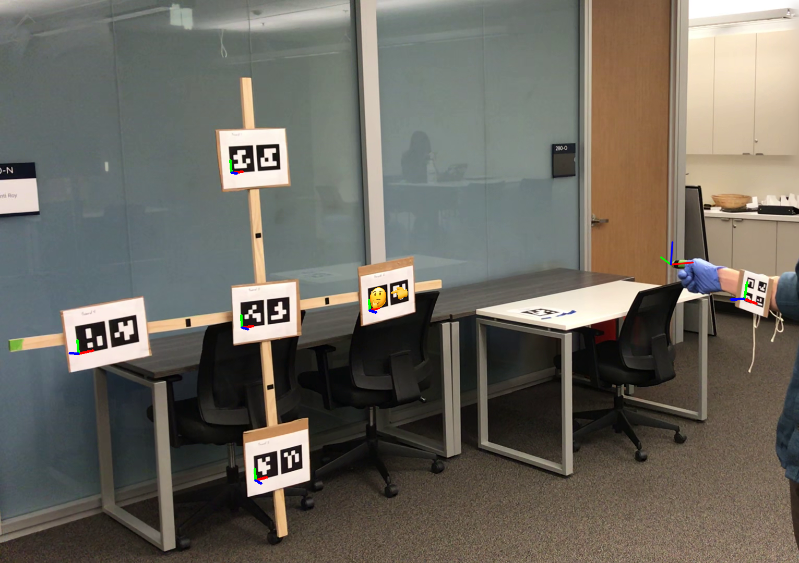
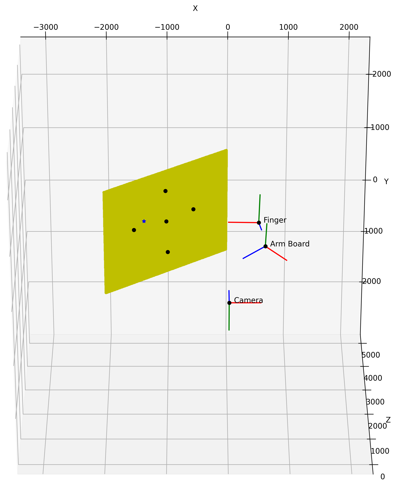

# Pointing Detection

| {: #image-url} |

#### Date

Fall 2021

### Description

In this project I worked with a partner on applying computer vision techniques to identify the pose of a pointing finger for robotics applications. The motivation being that it would be beneficial if robots could understand non-verbal communication such as pointing, and the methods developed in the project could be extended to other forms of non-verbal communication like sign-language.

I was the software implementation lead. I used Python, OpenCV, and MediaPipe to implement code that was able to:

* Read in a video or set of images
* Determine if there is a human in the video
* Determine if a human's hand was in the video
* Estimate the pose of a "pointing finger" using hand landmarks returned from the MediaPipe API and non-linear least-squares methods
* Estimate the pose of a "pointing finger" using color segmentation to isolate a set of rectangles and non-linear least-squares methods

#### Skills Used

* Python programming
* Use of open-source libraries such as OpenCV and numpy
* Research
* Experiment design
* Experiment analysis
* Writing
* Linux/Unix command line usage
* Git
* LaTeX

### Images

|  |
|:--|
| *Output results of our algorithm for the color segmentation task. Poses of objects are indicated with coordinate axes, and targeted ArUco tags are labeled with the finger pointing emoji for the finger target estimate and the thinking face emoji for the arm board target estimate.* |

|  |
|:--|
| *A 3D plot of the scene, containing the poses of all the objects in it. The yellow plane was formed by the origins of three of the five ArUco tags (shown in black), while the points and poses for the finger and arm board were found using our methods described in the Approach. The blue star on the plane indicates the intersection of the pointing line with the ArUco tag plane, and in this figure we see that it is closest to the left-most tag.* |
