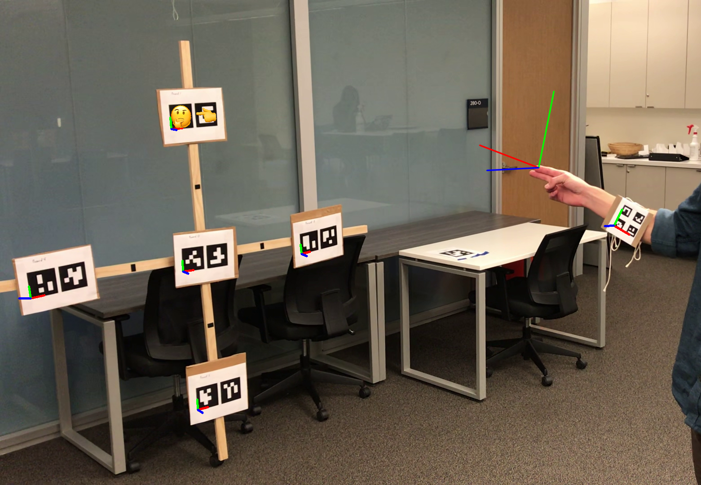

### [Core Scanner](./core-scanner)

A device for automating the process of photographing a drill core box to perform 2D to 3D reconstruction.

### [Needle Advancer](./needle-advancer)

A device that controls the velocity of a needle.

### [Pointing Detection](./pointing-detection)

